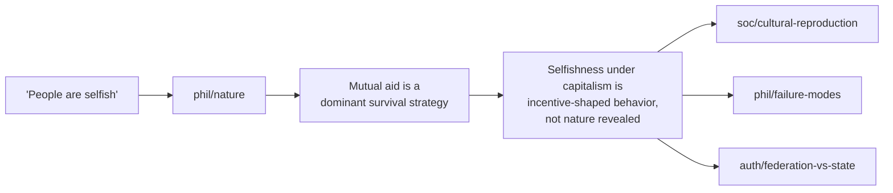

<p align="center">
  <picture>
    <source media="(prefers-color-scheme: dark)" srcset="https://retflo.org/img/readme/logo-dark.svg" />
    
  </picture>
</p>

<p align="center">
  <a href="https://retflo.org/license/"></a>
  <a href="https://retflo.org/nodes/"></a>
  <a href="https://retflo.org/nodes/"></a>
  <a href="https://retflo.org/nodes/"></a>
  <a href="https://retflo.org"></a>
</p>

<p align="center">
  The complete protocol for political reasoning.<br>
  Every structural objection to cooperative governance, mapped and answered.<br>
  Argue less. Build more.
</p>

<table>
<tr>
<td></td>
<td></td>
</tr>
<tr>
<td colspan="2"><em>Left: the protocol visualized as an <a href="https://retflo.org/visualizer/">interactive graph</a>. Right: retflo loaded as a skill in Claude Code.</em></td>
</tr>
</table>

## Why this exists

The same objections to cooperative governance have been recycled for centuries. "Human nature is selfish." "It can't scale." "Be realistic." The arguments don't change because they don't need to — repetition is the mechanism.

These aren't hard questions. They have structural answers. But those answers have never been organized in a way that connects them — where each response anticipates the next objection and routes to it.

retflo is that structure. A closed dialectical graph that maps the entire objection space, with every path answered and every connection typed. Not a chatbot. Not an app. A protocol — like TCP/IP is a protocol for data, retflo is a protocol for political reasoning.

## Try it

- [**Explore the graph**](https://retflo.org/visualizer/) — interactive, no setup needed
- [**Read the arguments**](https://retflo.org/nodes/) — browse by domain
- [**Tell any LLM**](https://retflo.org/agents) to read `retflo.org/agents` and debate you
- [**Install as a skill**](#install) for your coding agent

## Install

```bash
npx skills add retflo/retflo -g
```

Auto-detects your agent. Target a specific one with `-a`:

```bash
npx skills add retflo/retflo -g -a claude-code
npx skills add retflo/retflo -g -a cursor
npx skills add retflo/retflo -g -a gemini-cli
```

40+ agents supported. Run `npx skills add retflo/retflo --list` to see all.

For manual installation and other methods, see the [install docs](https://retflo.org/docs/install/).

This repo contains the nodes, routing table, and engagement rules — everything an LLM needs to navigate the framework. Also available through the [website](https://retflo.org), the [API](https://retflo.org/docs/api-reference/), and the [visualizer](https://retflo.org/visualizer/).

## How it works

[`AGENTS.md`](AGENTS.md) is the entry point. It contains the routing table that maps common objections to nodes, plus the engagement rules and delivery calibration.

Each node has:
- **Position** — the substantive case
- **Objection handling** — a Move / Response / Concession table
- **Typed connections** — links to follow-up nodes across domains

Nodes capture argument patterns, not instances. "China has a navy" and "Russia has nukes" route to the same node: external military threat.

### The chain in action



Objection in, structural response out, next move available. The graph is closed — follow any objection far enough and it routes back to territory the framework already covers.

## Domains

| Domain | Covers |
|--------|--------|
| Authority | State, governance, federation, enforcement, democracy, defense |
| Economics | Property, labor, markets, cooperatives, inequality, trade, commons |
| History | Revolutions, Mondragon, kibbutzim, Rojava, colonialism |
| Philosophy | Human nature, coercion, freedom, transition, direct action |
| Rhetoric | Framing, fallacies, burden of proof, debate tactics |
| Social | Structural oppression, propaganda, nationalism, education |
| Technology | Platform ownership, algorithmic governance |

59 arguments. 260 connections. 7 domains.

## Structure

```
retflo/
├── AGENTS.md            ← framework entry point
├── SKILL.md             ← skill ecosystem compatibility
├── STYLE-GUIDE.md       ← delivery calibration
└── nodes/
    ├── auth/            ← Authority & Governance
    ├── econ/            ← Economics & Ownership
    ├── hist/            ← Historical Cases
    ├── phil/            ← Philosophy
    ├── rhet/            ← Rhetoric & Tactics
    ├── soc/             ← Social Issues
    └── tech/            ← Technology
```

## License

[Retflo Cooperative Commons License (RCCL) v1.0](https://retflo.org/license/) — free for individuals, worker cooperatives, and democratic organizations. Commercial licensing available for investor-owned entities.

---

[retflo.org](https://retflo.org) · [Visualizer](https://retflo.org/visualizer/) · [Docs](https://retflo.org/docs/install/) · [API](https://retflo.org/docs/api-reference/) · [FAQ](https://retflo.org/faq/) · [Contact](mailto:contact@retflo.org)

© 2026 retflo™ contributors. Licensed under [RCCL v1.0](https://retflo.org/license/).

[](https://ko-fi.com/retflo)
